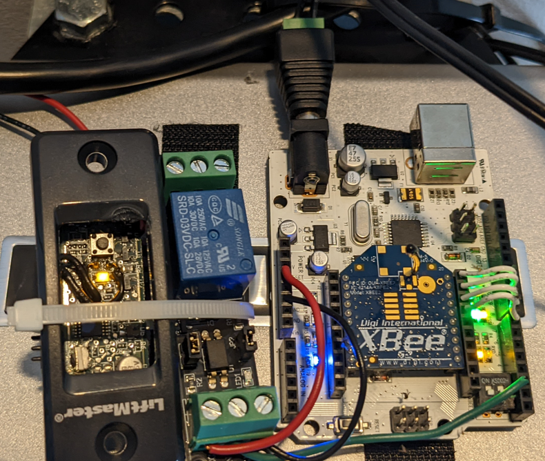

# xbeesharp
Initial .NET 6 C# implementation of [Digi XBee](https://www.digi.com/products/embedded-systems/digi-xbee/rf-modules/2-4-ghz-rf-modules/xbee-zigbee) ZigBee API operations, focusing on transmit request, remote AT command request, and receive packet. These cover all current requirements of my XBee devices.

Initial applications include [xbee2mqtt](https://github.com/idatum/xbeesharp/tree/main/apps/xbee2mqtt), which maps XBee receive packets to MQTT messages, as well as transmitting messages and remote AT commands from subscribed MQTT topics. It is implemented using [MQTTnet](https://github.com/dotnet/MQTTnet).

I use XBee devices for remote sensors (e.g. weather station), remote displays, and to open and close my garage door. The XBee garage door device replaces Chamberlain's myQ and all of its issues. Here is an image the XBee opener in all its glory, spider webs included, hanging off my LiftMaster opener:

I plan to add additional XBee API packets, but this initial working prototype has been solid so far, providing enough of an implementation to cover all of my current home automation needs. I run it in a Docker container and integrate with [HA](https://www.home-assistant.io/) using the MQTT integration.

### References

[XBee/XBee-PRO® S2C Zigbee® RF Module User Guide](https://www.digi.com/resources/documentation/digidocs/pdfs/90002002.pdf)

[.NET 6 on Rapsberry Pi](https://docs.microsoft.com/en-us/dotnet/iot/deployment)
