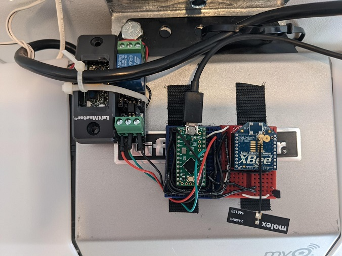

# xbeesharp
.NET 9 C# implementation of [Digi XBee](https://www.digi.com/products/embedded-systems/digi-xbee/rf-modules/2-4-ghz-rf-modules/xbee-zigbee) ZigBee API operations, focusing on transmit request, remote AT command request, and receive and IO packets. These cover all current scenarios of my XBee devices.

Initial applications include [xbee2mqtt](https://github.com/idatum/xbeesharp/tree/main/apps/xbee2mqtt), which maps XBee receive packets to MQTT messages, as well as transmitting messages and remote AT commands from subscribed MQTT topics. It is implemented using [MQTTnet](https://github.com/dotnet/MQTTnet). I use this to map all of my XBee device packets to MQTT messages. This is allows me to integrate with [Home Assistant](https://www.home-assistant.io/) and other custom applications I use for home automation.

## XBee for DIY
I use XBee devices for remote sensors (e.g. weather station), remote displays, and to open and close my garage door. Generally, I've found them to be great for DIY projects that need a wireless solution, including low power battery sensors. My DIY XBee garage door device replaces Chamberlain's myQ and all of its issues. Here is an image of the XBee opener in all its glory, spider webs included, hanging off my LiftMaster opener:



I use Mosquitto for MQTT and take full advantage of TLS and ACLs for securily publishing messages from Home Assistant to control the XBee garage door. This takes advantage of [xbee2mqtt's](https://github.com/idatum/xbeesharp/tree/main/apps/xbee2mqtt) ability to map MQTT messages to XBee transmit packets.

I currently use a [Teensy LC](https://www.pjrc.com/teensy/teensyLC.html) microcontroller which is comically overpowered for toggling a 3.3VDC relay. So I threw in a TMP36 sensor to use one of the ADC pins and periodically transmit its value using the XBee via one of the microcontroller's serial ports.

The need for a microcontroller is related to how the LiftMaster button works with the digital signal it generates, which requires a consistent on/off from the relay. Just sending ZBee AT commands to directly toggle the relay doesn't guarantee this.

Here's a Home Assistant Community discussion on using a LiftMaster button with a relay: [MyQ Alternatives](https://community.home-assistant.io/t/myq-alternatives/261805).

## Usage
This initial working implementation has been solid so far, providing enough of an implementation to cover all of my current home automation needs. I run it in a Docker container and integrate with [HA](https://www.home-assistant.io/) using the MQTT integration.

Here is a basic async example that reads the next receive packet on a coordinator, with support for a CancellationToken and ILogger<>:
```
var serialPort = new SerialPort("/dev/USB0", 115200);
serialPort.WriteTimeout = 500;
serialPort.Open();
var xbeeSerialAsync = new XbeeSerial(logger, cancellationToken);
while (!cancellationToken.IsCancellationRequested)
{
    XbeeFrame? xbeeFrame = await xbeeSerialAsync.ReadNextFrameAsync(serialPort, true);
    if (xbeeFrame != null && xbeeFrame.FrameType == XbeeFrame.PacketTypeReceive)
    {
        ReceivePacket? receivePacket;
        if (ReceivePacket.Parse(out receivePacket, xbeeFrame) && receivePacket != null)
        {
            var data = Encoding.Default.GetString(receivePacket.ReceiveData.ToArray());
            Console.WriteLine(data);
        }
    }
}
```

### References

[XBee/XBee-PRO® S2C Zigbee® RF Module User Guide](https://www.digi.com/resources/documentation/digidocs/pdfs/90002002.pdf)

[Deploy .NET apps to Raspberry Pi](https://docs.microsoft.com/en-us/dotnet/iot/deployment)

[MyQ Alternatives](https://community.home-assistant.io/t/myq-alternatives/261805) discussion in Home Assistant Community.
